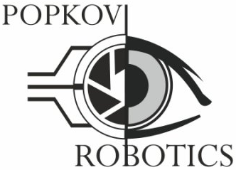
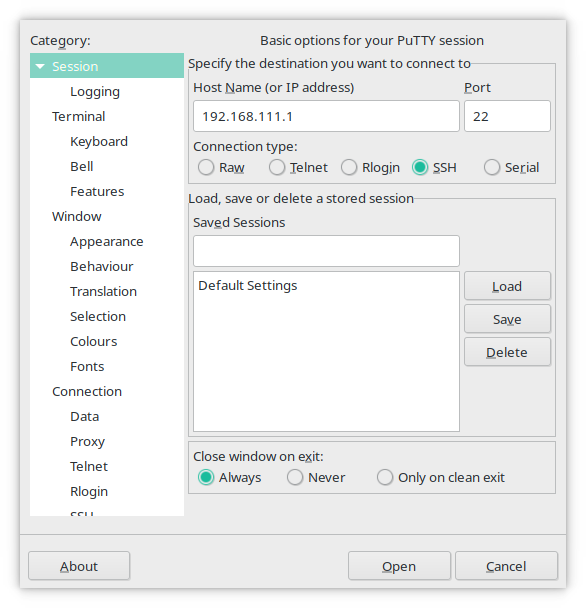

# RoboMobile



## Описание
RoboMobile - это проект, реализующий управление интеллектуальным беспилотным автомобилем (далее ИБПА). Проект имеет следующие возможности:
* Движение по чёрной направляющей линии
* Проезд развилок и перекрёстков по знакам
* Распознавание дорожных знаков, таких как:
  * 2.5 "движение без остановки запрещено"
  * 2.1 "главная дорога"
  * 6.4 "парковка"
  * 4.1.1 "движение прямо"
  * 4.1.2 "движение направо"
  * 4.1.3 "движение налево"
* Реакция на распознанные дорожные знаки (кроме парковки)
* Звуковое оповещение о распознанных знаках, разряде батарей (батарея считается разряженной, когда её напряжение ниже 6.9V)

## Подготовка перед работой
Перед работой убедитесь, что батареи ИБПА заряжены, то есть имеют напряжение выше 6.9V. Для дальнейшей работы необходимо включить ИБПА с помощью верхнего выключателя. Верхний выключатель сзади ИБПА отвечает за питание Jetson Nano и ArduShield (контроллер на базе Arduino Nano, с драйвером моторов и регулятором напряжения), а нижний отвечает за питание мотора. После загрузки ИБПА (загрузка длиться около 30 секунд) появится точка доступа Wi-Fi, с именем D**** (например, D0001). К это точке доступа необходимо подключиться, пароль от точки доступа: 12345678.

## Удаленное управление ИБПА
### Доступ по SSH
SSH (Secure Shell) - это утилита и сетевой протокол, позволяющий производить удалённое управление операционной системой подключённого устройства (в данном случае операционной системой ИБПА).

### PuTTY
PuTTY - кроссплатформенная клиент, для различных протоколов удалённого доступа, включая SSH и многие другие. Установите PuTTY по [ссылке](https://www.chiark.greenend.org.uk/~sgtatham/putty/latest.html) и запустите.

В поле "Host Name (or IP address)" записываем IP-адрес ИБПА: 192.168.111.1. Далее в разделе "Connection type" выбираем "SSH" и нажимаем кнопку "Open".
В появившемся окне записываем имя пользователя: jetson, а затем записываем пароль: jetson (вводимый пароль не будет отображаться на экране). Далее появится командная строка.

<p align="center">
  
</p>

### SSH
Для подключения к удалённому хосту используйте: ssh <span style="color:chartreuse;">[пользователь]@[IP адрес]</span>
```bash
ssh jetson@192.168.111.1
```
Далее введите пароль: jetson (вводимый пароль не будет виден).

### Доступ по SCP
SCP (Secure Copy Command) - это утилита и протокол безопасной передачи компьютерных файлов между локальным и удаленным хостом (в данном случае удалённым хостом является ИБПА).

### SCP
Копирование файлов 

scp <span style="color:chartreuse;">[пользователь]@[IP адрес]</span><span style="color:cornflowerblue;">:[файл для копирования]</span> <span style="color:chartreuse;">[пользователь]@[IP адрес]</span><span style="color:cornflowerblue;">:[файл, в который копируем]</span>

```bash
scp file.txt jetson@192.168.111.1:/home/jetson/file.txt
```

Копирование папок

scp -r <span style="color:chartreuse;">[пользователь]@[IP адрес]</span></span><span style="color:cornflowerblue;">:[папка для копирования]</span> <span style="color:chartreuse;">[пользователь]@[IP адрес]</span></span><span style="color:cornflowerblue;">:[папка назначения]</span>

Убедитесь, что у исходной папки нет косой черты, а у папки назначения она должна обязательно быть.

```bash
scp -r dir jetson@192.168.111.1:/home/jetson/
```

Если поменять местами локальный путь и сервер, то вы сможете копировать файлы c удаленного сервера на локальный компьютер.
После ввода команды scp необходимо будет ввести пароль от пользователя удалённого хоста (вводимый пароль не будет отображаться).

## Сборка и запуск 
Подключитесь к автомобилю по протоколу SSH. Если вы не знаете как это сделать, то прочитайте раздел Удаленное управление ИБПА/Доступ по SSH. Далее все команды необходимо вводить в командную строку SSH. 

Скачайте проект на ИБПА с помощью команды
```bash
git clone https://github.com/PopkovRobotics/RoboMobile.git 
cd RoboMobile
```

Создайте папку для сборки проекта
```bash
mkdir build && cd build
```

Скомпилируйте и запустите проект. Для остановки программы нажмите сочетание клавиш CTR+C.
```bash
cmake .. && make -j4
./RoboMobile
```

## Дерево каталогов
```bash
.
├── audio
│   ├── left.wav
│   ├── main_road.wav
│   ├── parking.wav
│   ├── right.wav
│   ├── stop.wav
│   └── top.wav
├── CMakeLists.txt
├── configs
│   └── config.json
├── imgs
│   ├── logo.png
│   └── putty.png
├── README.md
├── RoboMobile.cpp
└── sources
    ├── Arduino.cpp
    ├── Arduino.hpp
    ├── Config.cpp
    ├── Config.hpp
    ├── Decoder.cpp
    ├── Decoder.hpp
    ├── Engine.hpp
    ├── Lines.hpp
    ├── LogInfo.hpp
    ├── Loop.cpp
    ├── Loop.hpp
    ├── Mat.cpp
    ├── Mat.hpp
    ├── Object.cppd
    ├── Object.hpp
    ├── PID.cpp
    ├── PID.hpp
    ├── RecognitionLine.cpp
    ├── RecognitionLine.hpp
    ├── RecognitionSign.cpp
    ├── RecognitionSign.hpp
    ├── Server.cpp
    ├── Server.hpp
    ├── Signs.hpp
    ├── Timer.cpp
    ├── Timer.hpp
    ├── Video.cpp
    ├── Video.hpp
    ├── Webcam.cpp
    └── Webcam.hpp
```

## Контакты
* Одышев Артемий (Telegram: [@artemy_odeshev](https://t.me/artemy_odeshev))
* Виктор Ремхе (Telegram: [@VRemkhe](http://t.me/VRemkhe))
* Официальный [сайт](http://popkovrobotics.ru/)
* Почта support@popkovrobotics.ru

## Лицензия 
GNU General Public License v3.0
